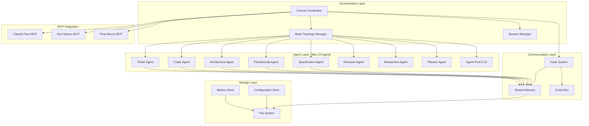

# Initialization System Architecture

## System Overview

This document defines the architecture for a mesh-topology swarm initialization system with centralized coordination mode, supporting up to 15 concurrent agents.

---

## 1. High-Level Architecture



---

## 2. Initialization Workflow Phases

### Phase 1: Bootstrap (0-5s)
```yaml
bootstrap:
  duration: 0-5s
  priority: critical

  steps:
    1_validate_environment:
      actions:
        - Check Node.js version (>=18)
        - Verify MCP server availability
        - Validate directory structure
        - Check write permissions

      validation:
        - claude-flow@alpha installed
        - ruv-swarm available (optional)
        - flow-nexus available (optional)

    2_initialize_topology:
      topology: mesh
      mode: centralized
      max_agents: 15

      mcp_command: |
        npx claude-flow@alpha swarm init \
          --topology mesh \
          --mode centralized \
          --max-agents 15

    3_setup_directories:
      structure:
        /src:
          - Source code and implementation
        /tests:
          - Test files (unit, integration, e2e)
        /docs:
          - Documentation and architecture
        /config:
          - Configuration files
        /scripts:
          - Utility and automation scripts
        /examples:
          - Example code and templates
```

### Phase 2: Agent Orchestration (5-15s)
```yaml
orchestration:
  duration: 5-15s
  priority: high

  agent_roles:
    specification:
      count: 1
      responsibility: "Requirements analysis and specification"
      outputs: ["/docs/specification.md"]

    pseudocode:
      count: 1
      responsibility: "Algorithm design and pseudocode"
      outputs: ["/docs/pseudocode.md"]

    architecture:
      count: 1
      responsibility: "System design and architecture"
      outputs: ["/docs/architecture.md"]

    coder:
      count: 2-4
      responsibility: "Implementation and code generation"
      outputs: ["/src/**/*.{js,ts}"]

    tester:
      count: 1-2
      responsibility: "Test creation and validation"
      outputs: ["/tests/**/*.test.{js,ts}"]

    reviewer:
      count: 1
      responsibility: "Code review and quality assurance"
      outputs: ["/docs/review-report.md"]

    researcher:
      count: 1
      responsibility: "Best practices and pattern research"
      outputs: ["/docs/research-findings.md"]

    planner:
      count: 1
      responsibility: "Task planning and coordination"
      outputs: ["/docs/plan.md"]

  spawning_strategy:
    mode: "concurrent"
    pattern: "single_message"

    task_commands: |
      // All agents spawned in single message via Claude Code Task tool
      Task("Specification Agent", "Analyze requirements...", "specification")
      Task("Pseudocode Agent", "Design algorithms...", "pseudocode")
      Task("Architecture Agent", "Create system design...", "architecture")
      Task("Coder Agent 1", "Implement core features...", "coder")
      Task("Coder Agent 2", "Build utilities...", "coder")
      Task("Tester Agent", "Write comprehensive tests...", "tester")
      Task("Reviewer Agent", "Review code quality...", "reviewer")
      Task("Researcher Agent", "Research best practices...", "researcher")
```

### Phase 3: Coordination Setup (15-30s)
```yaml
coordination:
  duration: 15-30s
  priority: high

  communication_patterns:
    mesh_topology:
      description: "All agents can communicate peer-to-peer"
      benefits:
        - High resilience
        - No single point of failure
        - Parallel coordination

      implementation:
        - Shared memory store
        - Event-driven messaging
        - Hook-based synchronization

    centralized_mode:
      description: "Central coordinator manages workflow"
      benefits:
        - Consistent state management
        - Simplified conflict resolution
        - Clear decision hierarchy

      coordinator_responsibilities:
        - Task assignment
        - Progress monitoring
        - Resource allocation
        - Conflict resolution

  memory_architecture:
    shared_memory:
      structure:
        swarm:
          topology: "mesh metadata"
          config: "swarm configuration"
          agents:
            specification: "spec outputs"
            pseudocode: "algorithm designs"
            architecture: "system designs"
            coder: "implementation artifacts"
            tester: "test results"
            reviewer: "review findings"

      access_pattern: "read-write-all"

      persistence: |
        npx claude-flow@alpha hooks post-edit \
          --file "[file]" \
          --memory-key "swarm/[agent]/[artifact]"
```

### Phase 4: Execution (30s+)
```yaml
execution:
  duration: 30s+
  priority: medium

  workflow:
    1_sparc_pipeline:
      sequence:
        - specification: "Define requirements"
        - pseudocode: "Design algorithms"
        - architecture: "Create system design"
        - refinement: "TDD implementation"
        - completion: "Integration and validation"

      parallelization:
        - specification + research (parallel)
        - pseudocode + architecture (sequential)
        - coding + testing (parallel)
        - review (sequential after coding)

    2_progress_tracking:
      methods:
        - Hook notifications
        - Memory updates
        - Metric collection

      commands: |
        npx claude-flow@alpha hooks notify \
          --message "Agent [name] completed [task]"

        npx claude-flow@alpha hooks post-task \
          --task-id "[task-id]"

    3_error_handling:
      strategies:
        - Agent retry (max 3 attempts)
        - Task reassignment
        - Graceful degradation

      self_healing: |
        npx claude-flow@alpha hooks route \
          --task "[failed-task]" \
          --strategy "reassign"
```

---

## 3. Agent Roles and Responsibilities

### Core SPARC Agents

#### Specification Agent
```yaml
role: specification
type: analyzer
priority: critical
dependencies: []

responsibilities:
  - Analyze project requirements
  - Define functional specifications
  - Identify constraints and assumptions
  - Document acceptance criteria

inputs:
  - User requirements
  - Project context
  - Domain knowledge

outputs:
  - /docs/specification.md
  - Memory: swarm/specification/requirements

coordination:
  pre_task: |
    npx claude-flow@alpha hooks pre-task \
      --description "Specification analysis"

  post_task: |
    npx claude-flow@alpha hooks post-edit \
      --file "docs/specification.md" \
      --memory-key "swarm/specification/complete"

success_criteria:
  - Clear, testable requirements
  - No ambiguous specifications
  - Stakeholder acceptance
```

#### Pseudocode Agent
```yaml
role: pseudocode
type: designer
priority: critical
dependencies: [specification]

responsibilities:
  - Design algorithms
  - Create data structures
  - Plan control flow
  - Document edge cases

inputs:
  - Specification document
  - Technical constraints
  - Performance requirements

outputs:
  - /docs/pseudocode.md
  - Memory: swarm/pseudocode/algorithms

coordination:
  memory_check: |
    # Wait for specification completion
    Check memory: swarm/specification/complete

  notify_completion: |
    npx claude-flow@alpha hooks notify \
      --message "Pseudocode design completed"

success_criteria:
  - Implementable algorithms
  - Complexity analysis documented
  - Edge cases covered
```

#### Architecture Agent
```yaml
role: architecture
type: system-architect
priority: critical
dependencies: [specification, pseudocode]

responsibilities:
  - Design system architecture
  - Define component boundaries
  - Plan technology stack
  - Document deployment strategy

inputs:
  - Specification
  - Pseudocode
  - Scalability requirements

outputs:
  - /docs/architecture.md
  - /docs/component-diagram.md
  - Memory: swarm/architecture/design

coordination:
  parallel_with: [researcher]
  memory_keys:
    - swarm/specification/requirements
    - swarm/pseudocode/algorithms

success_criteria:
  - Scalable design
  - Clear component boundaries
  - Technology decisions documented
```

### Implementation Agents

#### Coder Agents (2-4 instances)
```yaml
role: coder
type: implementer
priority: high
dependencies: [architecture]
max_instances: 4

responsibilities:
  instance_1:
    - Core business logic
    - Data models
    - API endpoints

  instance_2:
    - Utilities and helpers
    - Configuration management
    - Error handling

  instance_3:
    - Integration logic
    - External API clients
    - Data transformations

  instance_4:
    - Performance optimization
    - Caching strategies
    - Background jobs

inputs:
  - Architecture document
  - Pseudocode
  - Coding standards

outputs:
  - /src/**/*.{js,ts}
  - Memory: swarm/coder/[instance]/artifacts

coordination:
  work_distribution: "file-based partitioning"
  conflict_resolution: "central coordinator"

  sync_points:
    - After architecture completion
    - During code reviews
    - Before integration testing

success_criteria:
  - Passes all tests
  - Follows coding standards
  - Properly documented
```

#### Tester Agent
```yaml
role: tester
type: validator
priority: high
dependencies: [coder]
parallel_execution: true

responsibilities:
  - Write unit tests
  - Create integration tests
  - Develop e2e tests
  - Validate test coverage (>90%)

inputs:
  - Source code
  - Specification
  - Architecture

outputs:
  - /tests/**/*.test.{js,ts}
  - Coverage report
  - Memory: swarm/tester/results

coordination:
  execution_mode: "parallel_with_coding"

  hooks: |
    # Monitor for new code
    npx claude-flow@alpha hooks post-edit \
      --file "src/**" \
      --trigger "generate-tests"

success_criteria:
  - >90% code coverage
  - All tests passing
  - TDD methodology followed
```

### Quality Assurance Agents

#### Reviewer Agent
```yaml
role: reviewer
type: quality-assurance
priority: medium
dependencies: [coder, tester]

responsibilities:
  - Code quality review
  - Security audit
  - Performance analysis
  - Documentation review

inputs:
  - Source code
  - Test results
  - Architecture document

outputs:
  - /docs/review-report.md
  - Memory: swarm/reviewer/findings

coordination:
  execution_phase: "post_implementation"

  review_checklist:
    - Code style compliance
    - Security vulnerabilities
    - Performance bottlenecks
    - Documentation completeness

success_criteria:
  - No critical issues
  - All recommendations documented
  - Team consensus reached
```

#### Researcher Agent
```yaml
role: researcher
type: advisor
priority: low
dependencies: []
parallel_execution: true

responsibilities:
  - Research best practices
  - Identify design patterns
  - Evaluate technologies
  - Document findings

inputs:
  - Project domain
  - Technology stack
  - Industry standards

outputs:
  - /docs/research-findings.md
  - Memory: swarm/researcher/recommendations

coordination:
  execution_mode: "parallel_with_all"
  update_frequency: "continuous"

success_criteria:
  - Relevant patterns identified
  - Technology recommendations provided
  - Best practices documented
```

---

## 4. Coordination Patterns

### Pattern 1: Sequential SPARC Flow
```yaml
pattern_name: "Sequential SPARC"
use_case: "Complex projects requiring strict phase gates"

flow:
  phase_1:
    agents: [specification]
    wait_for_completion: true
    gate: "specification_approved"

  phase_2:
    agents: [pseudocode]
    wait_for_completion: true
    gate: "algorithms_validated"

  phase_3:
    agents: [architecture]
    wait_for_completion: true
    gate: "design_approved"

  phase_4:
    agents: [coder, tester]
    parallel: true
    wait_for_completion: true
    gate: "tests_passing"

  phase_5:
    agents: [reviewer]
    wait_for_completion: true
    gate: "review_complete"

implementation: |
  # Each phase executed sequentially
  Task("Spec Agent", "...", "specification")
  # Wait for completion via memory check
  Task("Pseudo Agent", "...", "pseudocode")
  # Continue pattern...
```

### Pattern 2: Parallel Batch Processing
```yaml
pattern_name: "Parallel Batch"
use_case: "Independent tasks requiring speed"

flow:
  batch_1_research_and_spec:
    agents: [specification, researcher]
    parallel: true
    duration: "5-10s"

  batch_2_design:
    agents: [pseudocode, architecture]
    parallel: true
    wait_for: batch_1
    duration: "10-20s"

  batch_3_implementation:
    agents: [coder_1, coder_2, coder_3, tester]
    parallel: true
    wait_for: batch_2
    duration: "30-60s"

  batch_4_quality:
    agents: [reviewer]
    wait_for: batch_3
    duration: "10-15s"

implementation: |
  // Single message spawns all batch 1 agents
  Task("Spec Agent", "...", "specification")
  Task("Research Agent", "...", "researcher")

  // After completion, batch 2 in single message
  Task("Pseudo Agent", "...", "pseudocode")
  Task("Arch Agent", "...", "architecture")
```

### Pattern 3: Mesh Collaboration
```yaml
pattern_name: "Mesh Collaboration"
use_case: "Complex interdependent tasks"

topology: mesh
coordination: peer-to-peer
memory: shared

flow:
  initialization:
    - All agents spawned concurrently
    - Shared memory established
    - Event bus activated

  collaboration:
    - Agents communicate peer-to-peer
    - No central bottleneck
    - Self-organizing workflow

  synchronization:
    - Memory-based coordination
    - Event-driven updates
    - Hook-based checkpoints

implementation: |
  // All agents in single message
  Task("Spec Agent", "Check memory for research", "specification")
  Task("Research Agent", "Store findings in memory", "researcher")
  Task("Pseudo Agent", "Monitor spec in memory", "pseudocode")
  Task("Arch Agent", "Monitor pseudo in memory", "architecture")
  Task("Coder 1", "Monitor arch in memory", "coder")
  Task("Coder 2", "Coordinate with Coder 1", "coder")
  Task("Tester", "Monitor all code changes", "tester")
  Task("Reviewer", "Continuous review", "reviewer")

benefits:
  - No single point of failure
  - High parallelism
  - Adaptive workflow
  - Resilient to agent failures
```

### Pattern 4: Hierarchical Coordination
```yaml
pattern_name: "Hierarchical Coordination"
use_case: "Large teams requiring clear hierarchy"

structure:
  coordinator_agent:
    role: "Central Coordinator"
    responsibilities:
      - Task assignment
      - Progress monitoring
      - Conflict resolution
      - Resource allocation

  team_leads:
    - design_lead: [specification, pseudocode, architecture]
    - implementation_lead: [coder_1, coder_2, coder_3]
    - quality_lead: [tester, reviewer]

  workers:
    - Execute assigned tasks
    - Report to team leads
    - Collaborate with peers

communication:
  vertical: "Coordinator <-> Leads <-> Workers"
  horizontal: "Workers <-> Workers (within team)"

implementation: |
  npx claude-flow@alpha swarm init \
    --topology hierarchical \
    --max-agents 15

  Task("Coordinator", "Manage workflow", "hierarchical-coordinator")
  Task("Design Lead", "Lead design team", "planner")
  Task("Impl Lead", "Lead implementation", "planner")
  Task("QA Lead", "Lead quality team", "planner")
  // Workers spawned by leads
```

---

## 5. Directory Structure

```
/Users/gokhunguneyhan/yt-summarise/
│
├── src/                          # Source code
│   ├── core/                     # Core business logic
│   │   ├── models/               # Data models
│   │   ├── services/             # Business services
│   │   └── controllers/          # API controllers
│   ├── utils/                    # Utility functions
│   │   ├── validators/           # Input validation
│   │   ├── formatters/           # Data formatting
│   │   └── helpers/              # Helper functions
│   ├── config/                   # Runtime configuration
│   │   ├── database.js           # Database config
│   │   ├── server.js             # Server config
│   │   └── environment.js        # Environment variables
│   └── integrations/             # External integrations
│       ├── api-clients/          # API clients
│       └── webhooks/             # Webhook handlers
│
├── tests/                        # Test files
│   ├── unit/                     # Unit tests
│   │   ├── models/               # Model tests
│   │   ├── services/             # Service tests
│   │   └── utils/                # Utility tests
│   ├── integration/              # Integration tests
│   │   ├── api/                  # API endpoint tests
│   │   └── database/             # Database tests
│   ├── e2e/                      # End-to-end tests
│   │   └── workflows/            # User workflow tests
│   └── fixtures/                 # Test data and mocks
│
├── docs/                         # Documentation
│   ├── architecture/             # Architecture docs
│   │   ├── initialization-architecture.md
│   │   ├── component-diagram.md
│   │   └── deployment-diagram.md
│   ├── specifications/           # Requirement specs
│   │   ├── functional-spec.md
│   │   └── technical-spec.md
│   ├── pseudocode/               # Algorithm designs
│   │   └── core-algorithms.md
│   ├── reviews/                  # Code reviews
│   │   └── review-reports.md
│   └── api/                      # API documentation
│       └── openapi.yaml
│
├── config/                       # Configuration files
│   ├── eslint.config.js          # Linting rules
│   ├── jest.config.js            # Test configuration
│   ├── tsconfig.json             # TypeScript config
│   └── swarm-config.json         # Swarm configuration
│
├── scripts/                      # Utility scripts
│   ├── init-swarm.sh             # Swarm initialization
│   ├── run-tests.sh              # Test runner
│   ├── deploy.sh                 # Deployment script
│   └── cleanup.sh                # Cleanup utilities
│
├── examples/                     # Example code
│   ├── basic-usage/              # Basic examples
│   ├── advanced-patterns/        # Advanced patterns
│   └── templates/                # Code templates
│
├── .github/                      # GitHub configuration
│   └── workflows/                # CI/CD workflows
│
├── package.json                  # Project dependencies
├── CLAUDE.md                     # Claude configuration
└── README.md                     # Project overview
```

---

## 6. Technology Stack

### Core Technologies
```yaml
runtime:
  nodejs: ">=18.0.0"
  package_manager: "npm"

orchestration:
  primary: "Claude Flow (@alpha)"
  optional:
    - "Ruv-Swarm (enhanced coordination)"
    - "Flow-Nexus (cloud features)"

coordination:
  topology: "mesh"
  mode: "centralized"
  max_agents: 15

testing:
  framework: "Jest"
  coverage_target: ">90%"
  strategy: "TDD (Test-Driven Development)"

code_quality:
  linting: "ESLint"
  formatting: "Prettier"
  type_checking: "TypeScript"

documentation:
  format: "Markdown"
  diagrams: "Mermaid"
  api_docs: "OpenAPI 3.0"
```

### MCP Server Integration
```yaml
claude_flow:
  status: required
  version: "@alpha"
  features:
    - Swarm initialization
    - Hook system
    - Memory management
    - Task orchestration
    - Session management

  commands:
    init: "npx claude-flow@alpha swarm init"
    hooks: "npx claude-flow@alpha hooks [hook-name]"
    memory: "npx claude-flow@alpha memory [operation]"

ruv_swarm:
  status: optional
  features:
    - Enhanced neural coordination
    - Advanced agent metrics
    - DAA (Dynamic Agent Adaptation)
    - Performance benchmarking

  commands:
    init: "npx ruv-swarm swarm init"
    monitor: "npx ruv-swarm swarm monitor"

flow_nexus:
  status: optional
  features:
    - Cloud-based execution
    - Template marketplace
    - Real-time monitoring
    - Sandbox environments

  auth_required: true
  commands:
    register: "npx flow-nexus@latest register"
    login: "npx flow-nexus@latest login"
```

---

## 7. Scalability and Performance

### Agent Scaling Strategy
```yaml
scaling_policies:
  min_agents: 3
  max_agents: 15
  default_agents: 8

  scale_up_triggers:
    - task_queue_length > 10
    - avg_response_time > 30s
    - memory_pressure < 20%

  scale_down_triggers:
    - task_queue_length < 2
    - idle_agents > 5
    - completion_rate > 90%

resource_allocation:
  per_agent:
    memory: "256MB baseline"
    cpu: "Shared pool"
    priority: "Task-based"

  coordinator:
    memory: "512MB"
    cpu: "Dedicated"
    priority: "highest"
```

### Performance Optimization
```yaml
optimization_strategies:
  parallel_execution:
    description: "Execute independent tasks concurrently"
    benefit: "2.8-4.4x speed improvement"
    implementation: "Single message task spawning"

  memory_caching:
    description: "Cache frequently accessed data"
    benefit: "Reduced memory operations"
    ttl: "Session duration"

  hook_batching:
    description: "Batch hook operations"
    benefit: "Reduced overhead"
    batch_size: "10 operations"

  smart_routing:
    description: "Route tasks to optimal agents"
    benefit: "Load balancing"
    strategy: "Skill-based + load-based"

performance_targets:
  initialization: "<5s"
  agent_spawn: "<2s per agent"
  task_completion: "Varies by complexity"
  total_workflow: "<5 minutes for typical project"
```

---

## 8. Security and Compliance

### Security Architecture
```yaml
security_layers:
  environment:
    - No hardcoded secrets
    - Environment variable usage
    - .env file management
    - Secrets rotation policy

  code:
    - Input validation
    - Output sanitization
    - Dependency scanning
    - SAST/DAST integration

  runtime:
    - Sandboxed execution
    - Resource limits
    - Network policies
    - Audit logging

compliance_requirements:
  code_quality:
    - ESLint passing
    - 90% test coverage
    - No critical vulnerabilities
    - Documentation complete

  review_process:
    - Peer review required
    - Security scan passing
    - Performance benchmarks met
    - Stakeholder approval
```

---

## 9. Monitoring and Observability

### Monitoring Strategy
```yaml
metrics:
  agent_metrics:
    - task_completion_rate
    - avg_response_time
    - error_rate
    - resource_usage

  swarm_metrics:
    - active_agents
    - task_queue_length
    - coordination_overhead
    - memory_usage

  performance_metrics:
    - throughput
    - latency_p50_p95_p99
    - success_rate
    - token_usage

logging:
  levels: [error, warn, info, debug]
  destinations:
    - console
    - file: /logs/swarm.log
    - memory: swarm/logs/*

  structured_format:
    timestamp: ISO8601
    level: string
    agent: string
    message: string
    context: object

observability_hooks: |
  npx claude-flow@alpha hooks metrics --export true
  npx claude-flow@alpha hooks intelligence_stats
  npx claude-flow@alpha hooks model-stats
```

---

## 10. Error Handling and Resilience

### Error Handling Strategy
```yaml
error_categories:
  transient_errors:
    examples: [network_timeout, rate_limit, temporary_unavailable]
    strategy: "Retry with exponential backoff"
    max_retries: 3

  permanent_errors:
    examples: [invalid_input, auth_failure, resource_not_found]
    strategy: "Fail fast and report"
    retry: false

  agent_failures:
    examples: [crash, timeout, unresponsive]
    strategy: "Reassign task to backup agent"
    escalation: "Coordinator intervention"

resilience_patterns:
  circuit_breaker:
    threshold: "5 failures in 60s"
    timeout: "30s"
    recovery: "Automatic after success"

  bulkhead:
    isolation: "Agent-level"
    resource_limits: "Per-agent quotas"
    overflow: "Queue or reject"

  retry:
    strategy: "Exponential backoff"
    base_delay: "1s"
    max_delay: "30s"
    max_attempts: 3

self_healing: |
  npx claude-flow@alpha hooks route \
    --task "[failed-task]" \
    --strategy "reassign"

  npx claude-flow@alpha hooks worker-detect \
    --issue "unresponsive-agent"
```

---

## 11. Integration Points

### Hook Integration
```yaml
pre_operation_hooks:
  pre-task:
    purpose: "Register task start"
    command: "hooks pre-task --description '[desc]'"
    required: true

  pre-edit:
    purpose: "Prepare file for editing"
    command: "hooks pre-edit --file '[path]'"
    auto_formatting: true

post_operation_hooks:
  post-task:
    purpose: "Register task completion"
    command: "hooks post-task --task-id '[id]'"
    required: true

  post-edit:
    purpose: "Store artifact in memory"
    command: "hooks post-edit --file '[path]' --memory-key '[key]'"
    triggers:
      - neural_training
      - memory_update
      - metric_collection

session_hooks:
  session-start:
    purpose: "Initialize session context"
    command: "hooks session-start --session-id '[id]'"

  session-end:
    purpose: "Export session data"
    command: "hooks session-end --export-metrics true"

  session-restore:
    purpose: "Restore previous session"
    command: "hooks session-restore --session-id '[id]'"

notification_hooks:
  notify:
    purpose: "Broadcast agent status"
    command: "hooks notify --message '[msg]'"
    recipients: [coordinator, peers]
```

### Memory Management
```yaml
memory_structure:
  swarm:
    topology: "Mesh metadata"
    config: "Swarm configuration"
    session: "Session state"

  agents:
    specification:
      requirements: "Functional requirements"
      constraints: "Technical constraints"
      acceptance: "Acceptance criteria"

    pseudocode:
      algorithms: "Algorithm designs"
      complexity: "Complexity analysis"
      edge_cases: "Edge case handling"

    architecture:
      design: "System architecture"
      components: "Component definitions"
      technologies: "Tech stack decisions"

    coder:
      artifacts: "Code implementations"
      commits: "Change history"
      conflicts: "Merge conflicts"

    tester:
      results: "Test execution results"
      coverage: "Coverage reports"
      failures: "Failure analysis"

    reviewer:
      findings: "Review findings"
      recommendations: "Improvement suggestions"
      approvals: "Approval status"

memory_operations: |
  # Store
  npx claude-flow@alpha hooks post-edit \
    --file "[file]" \
    --memory-key "swarm/[agent]/[key]"

  # Retrieve (via agent checking memory before work)
  # Each agent checks relevant memory keys before starting
```

---

## 12. Deployment and CI/CD

### Deployment Architecture
```yaml
environments:
  development:
    swarm_mode: "development"
    max_agents: 5
    monitoring: "debug level"

  staging:
    swarm_mode: "staging"
    max_agents: 10
    monitoring: "info level"

  production:
    swarm_mode: "production"
    max_agents: 15
    monitoring: "warn level"

ci_cd_pipeline:
  stages:
    1_init:
      - Initialize swarm
      - Validate configuration
      - Setup directories

    2_build:
      - Run SPARC workflow
      - Generate artifacts
      - Build packages

    3_test:
      - Unit tests
      - Integration tests
      - E2E tests
      - Coverage check (>90%)

    4_quality:
      - Code review
      - Security scan
      - Performance benchmark

    5_deploy:
      - Package application
      - Deploy to environment
      - Health checks
      - Smoke tests

automation: |
  # GitHub Actions example
  - name: Initialize Swarm
    run: npx claude-flow@alpha swarm init --mode production

  - name: Run SPARC Pipeline
    run: npx claude-flow@alpha sparc pipeline "Build feature"

  - name: Export Metrics
    run: npx claude-flow@alpha hooks session-end --export-metrics true
```

---

## 13. Success Criteria

### Initialization Success
```yaml
criteria:
  environment:
    - All directories created
    - MCP servers available
    - Dependencies installed
    - Configuration valid

  swarm:
    - Topology initialized (mesh)
    - Mode set (centralized)
    - Max agents configured (15)
    - Session established

  agents:
    - All required agents spawned
    - Hooks registered
    - Memory initialized
    - Communication established

  workflow:
    - SPARC phases defined
    - Task queue populated
    - Coordination active
    - Monitoring enabled

validation_commands: |
  npx claude-flow@alpha swarm status
  npx claude-flow@alpha agent list
  npx claude-flow@alpha hooks list
  npx claude-flow@alpha hooks intelligence_stats
```

### Project Success
```yaml
criteria:
  code_quality:
    - All tests passing
    - Coverage >90%
    - No critical issues
    - Documentation complete

  performance:
    - Initialization <5s
    - Total workflow <5min
    - Token reduction >30%
    - Speed improvement >2.8x

  deliverables:
    - Specification document
    - Architecture design
    - Working implementation
    - Comprehensive tests
    - Review report

  compliance:
    - SPARC methodology followed
    - Best practices applied
    - Security validated
    - Stakeholder approval
```

---

## 14. Future Enhancements

### Phase 2 Capabilities
```yaml
enhancements:
  advanced_coordination:
    - Dynamic topology switching
    - Adaptive agent spawning
    - Predictive task routing
    - Load balancing optimization

  ai_powered:
    - Neural pattern recognition
    - Automatic error correction
    - Performance auto-tuning
    - Intelligent caching

  enterprise_features:
    - Multi-project support
    - Team management
    - Cost tracking
    - Compliance reporting

  integrations:
    - GitHub deep integration
    - Jira synchronization
    - Slack notifications
    - Cloud deployment automation
```

---

## Summary

This initialization architecture provides:

1. **Structured Workflow**: Clear phases from bootstrap to execution
2. **Agent Orchestration**: Defined roles and coordination patterns
3. **Scalability**: Support for 15 concurrent agents with mesh topology
4. **Resilience**: Error handling, retry logic, and self-healing
5. **Observability**: Comprehensive monitoring and logging
6. **Best Practices**: SPARC methodology, TDD, security-first
7. **Performance**: Parallel execution with 2.8-4.4x speed improvements

**Key Architectural Decisions**:
- Mesh topology for resilience and parallelism
- Centralized mode for consistent coordination
- Hook-based synchronization for loose coupling
- Memory-based state management for persistence
- File-based organization for maintainability
- MCP integration for advanced features

**Next Steps**:
1. Bootstrap environment validation
2. Initialize swarm topology
3. Spawn agents concurrently via Task tool
4. Execute SPARC workflow
5. Monitor progress and adjust
6. Export metrics and learnings

---

*Architecture designed by SPARC Architecture Agent*
*Date: 2026-01-29*
*Version: 1.0.0*
